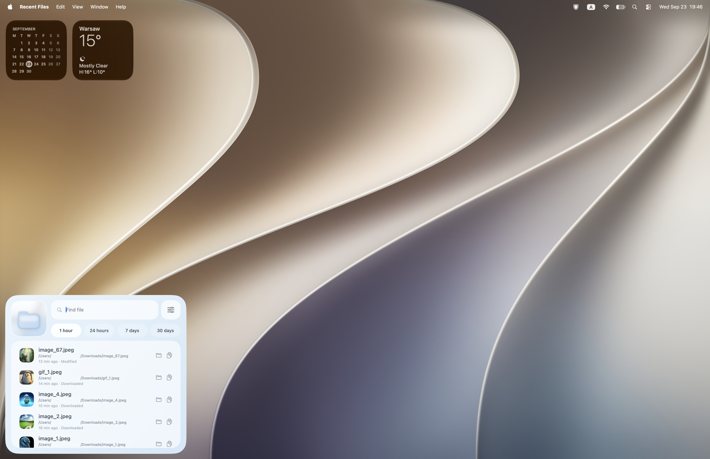
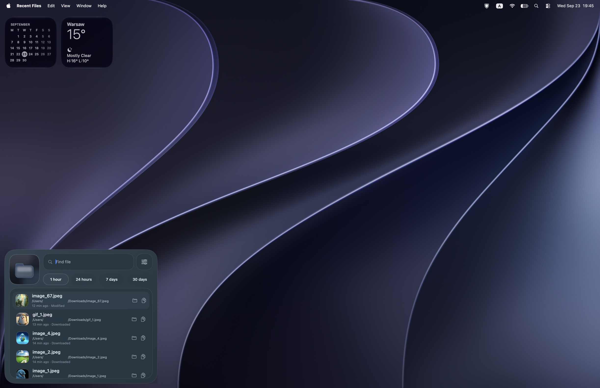

# Recent Files for macOS

A native macOS utility built with SwiftUI and AppKit. It watches the top level of configured folders (Downloads and Desktop by default), shows files modified or created within the selected time period, and provides search, Finder reveal, copy path, appearance, login item, and global shortcut settings.

## Screenshots

### Light mode
.png>)


### Dark mode
.png>)


## Build

Open `macos/RecentFiles.xcodeproj` in Xcode and build the `RecentFiles` scheme, or run:

```sh
xcodebuild -project macos/RecentFiles.xcodeproj -scheme RecentFiles -configuration Release -destination 'platform=macOS' build
```

## Install

1. Download the latest `Recent Files-macOS.dmg` from GitHub Releases.
2. Open the DMG and drag `Recent Files.app` to Applications.
3. Before opening the app, go to System Settings → Privacy & Security → Accessibility. Click `+`, select `Recent Files.app` from Applications, and enable it.
4. Open Recent Files from Applications.

Accessibility access is required for the global keyboard shortcut. If macOS blocks the first launch, Control-click the app, choose Open, then confirm.

The deployment target remains macOS 12.0. The launch-at-login option uses `SMAppService` and is available on macOS 13 and later.

The global shortcut uses a local macOS event tap so another app cannot respond to the same selected combination. macOS requires the user to grant Recent Files Accessibility access for this feature; the app only handles key codes and modifier flags, and does not record or transmit typed text. The supplied light and dark logos are bundled separately: the main view and running Dock icon follow the app's selected theme.
